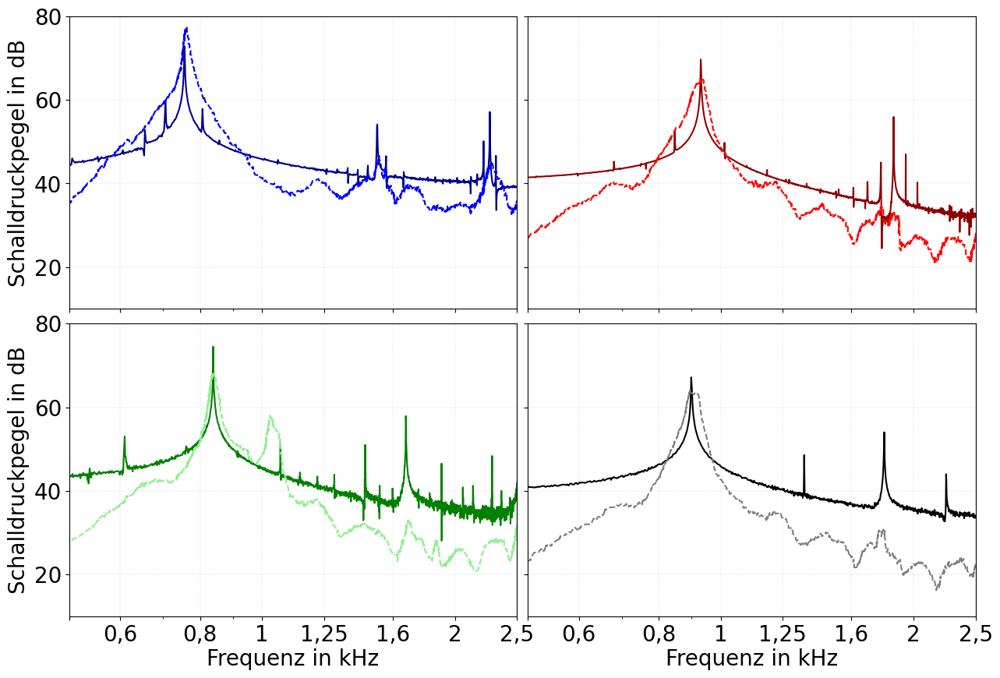
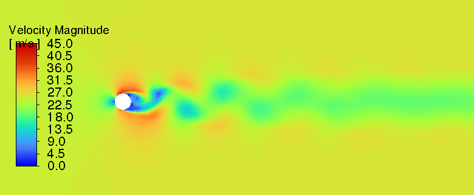
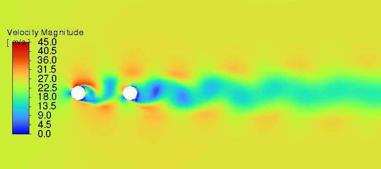
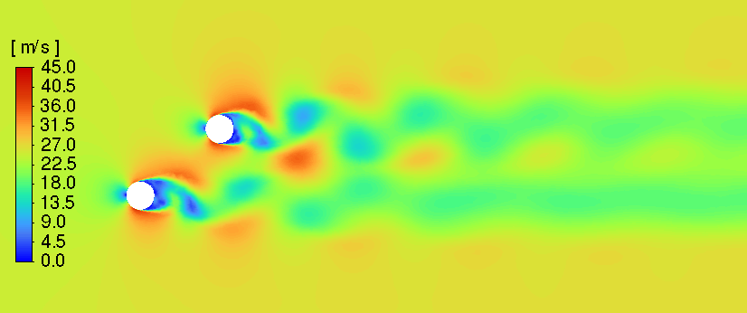
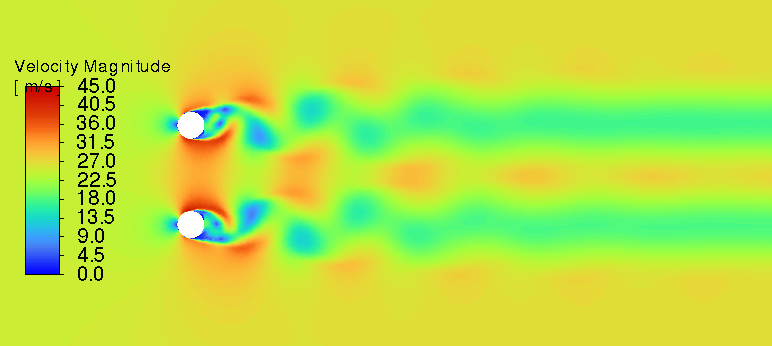

# Aerodynamische Schallentstehung an zwei versetzt angeordneten Zylindern gleichen Durchmessers

Paul Abromeit, Thomas Geyer, Lars Enghardt

## DAGA 2024 Late Poster Beitrag - Abstract
Die komplexe Umströmung von zwei versetzt angeordneten Zylindern ist in verschiedenen technischen Anwendungen,
wie zum Beispiel dem Fahrwerk von Flugzeugen oder Schutzgittern von Ventilatoren, wiederzufinden. Obwohl es
zahlreiche numerische und experimentelle Untersuchungen zu diesem Aufbau gibt, beschäftigen sich nur wenige davon
mit der Schallentstehung. In der hier vorgestellten Untersuchung wurde die Schallentstehung einer Tandemzylinderanordnung bei verschiedenen Anstellwinkeln in einem kleinen akustischen Freistrahlwindkanal bei Reynolds-Zahlen
(bezogen auf den Zylinderdurchmesser) zwischen 3.300 und 11.500 gemessen. Der Winkel zwischen den Zylindern
wurde zwischen 0◦ und 90◦ in Schritten von 5◦ variiert. Die resultierenden Spektren der Schalldruckpegel zeigen auffällige tonale Merkmale und bei bestimmten Winkeln und Abständen zwischen den Zylindern konnte ein bistabiles
Verhalten beobachtet werden. Dabei teilt sich das tonale Maximum des Spektrums in zwei Maxima auf und vereinigt
sich bei höheren Anstellwinkeln wieder zu einem Maximum. Zum besseren Verständnis dieser Mechanismen wurden
für verschiedene Anstellwinkel qualitative Strömungssimulationen durchgeführt.

## Literatur
* [1] Zdravkovich, M. M. (1977). Review of flow interference between two circular cylinders in various arrangements. ASME JOURNAL OF FLUIS ENGINEERING, Vol. 99, No. 4, 1977, pp. 618-633.
* [2] Zhou, Yu. (2016). Wake of two interacting circular cylinders: A review. International Journal of Heat and Fluid Flow. 62. 510-537, https://doi.org/10.1016/j.ijheatfluidflow.2016.08.008. 
* [3] Günter Schewe, Markus Jacobs, Experiments on the Flow around two tandem circular cylinders from sub- up to transcritical Reynolds numbers, Journal of Fluids and Structures, Volume 88, 2019, Pages 148-166, ISSN 0889-9746, https://doi.org/10.1016/j.jfluidstructs.2019.05.001.
* [4] M.H. Akbari, S.J. Price, Numerical investigation of flow patterns for staggered cylinder pairs in cross-flow, Journal of Fluids and Structures, Volume 20, Issue 4, 2005, Pages 533-554, ISSN 0889-9746, https://doi.org/10.1016/j.jfluidstructs.2005.02.005.
* [5] Thomas F. Geyer and Lars Enghardt. "Noise generation by two staggered circular cylinders of equal diameter in cross-flow," AIAA 2022-3093. 28th AIAA/CEAS Aeroacoustics 2022 Conference. June 2022. https://arc.aiaa.org/doi/10.2514/6.2022-3093

## Diagramme

